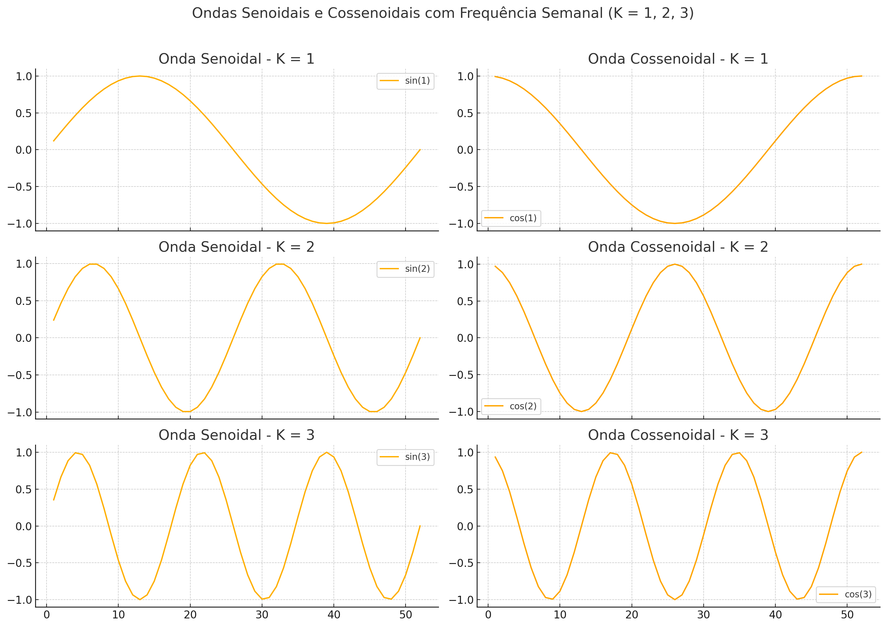

<br>


# MODELO SARIMA

Séries econômicas com periodicidade inferior a um ano, mensais ou trimestrais, por exemplo, normalmente exibem autocorrelação importante entre as observações dos instantes do tempo distantes entre si por *s* ou múltiplos de **s**, em que o **s** é o número de períodos contidos em um ano (**s**=12 para dados mensais e igual a 4 para dados trimestrais); 

Esta correlação é devido à sazonalidade que é comum em séries de preços; 

A correlação sazonal precisa ser modelada e por isto surgem os modelos **ARIMA sazonais** denominados de modelos **SARIMA**.

Os modelos SARIMA incorporam, alem dos componentes AR(p), MA(q) e d diferenciações consecutivas, os componentes autoregressivo sazonal, SAR(P), média móvel sazonal, SMA(Q), e D diferenciações sazonais necessárias caso a série apresente raiz unitária sazonal;

Assim, tem-se a denominação $SARIMA(p,d,q)x(P,D,Q)_s$; 

A diferenciação sazonal é dada por

$$
\Delta_{12}Y_t=Y_t-Y_{t-12}=(1-L^{12})Y_t
$$

em que $\Delta_{12}=(1-L^{12})$ é chamado de *operador de diferença sazonal*

No R a série com uma diferença sazonal de 12 meses é gerada com ``ds12x <- diff(x, lag=12)`` na qual x é a série a ser diferenciada sazonalmente.

No Python a série com uma diferença sazonal de 12 meses é gerada com ``ds12x <- x.diff(12)`` na qual x é a série a ser diferenciada sazonalmente.
 
No caso de modelos estacionários puramente sazonais que apresentam componentes sazonais autorregressivos (SAR) e de média móvel (SMA), tem-se a seguinte estrutura:

$$
y_t=A_1y_{t-s}+\dots+A_Py_{t-Ps}+u_t+M_1u_{t-s}+\dots+M_Qu_{t-Qs}
$$

$$
y_t-A_1y_{t-s}-\dots-A_Py_{t-Ps}=u_t+M_1u_{t-s}+\dots+M_Qu_{t-Qs}
$$

$$
(1-A_1L^s-\dots-A_PL^{Ps})yt=(1+M_1L^S+\dots+M_QL^{Qs})u_t
$$

Caso a série não seja estacionária, precisando ser diferenciada sazonalmente, o modelo sazonal autorregressivo integrado de médias móveis é dado por:

$$
y_t-y_{t-s}=A_1y_{t-s}+\dots+A_Py_{t-Ps}+u_t+M_1u_{t-s}+\dots+M_Qu_{t-Qs}-y_{t-s}
$$

$$
\Delta_s^Dy_t=y_{t-s}(A-1)+\dots+A_Py_{t-Ps}+u_t+M_1u_{t-s}+\dots+M_Qu_{t-Qs}
$$

$$
(1-A_1L^s-\dots-A_PL^{Ps})\Delta_s^Dy_t=(1-M_1L^S-\dots-M_QL^{Qs})u_t
$$

que pode ser escrito de forma compacta como:

$$
A(L^s)\Delta_s^Dy_t=M(L^s)u_t
$$

E o modelo SARIMA geral $(p,d,q)x(P,D,Q)_s$ pode ser dado por

$$
\alpha(L)A(L^s)\Delta_s^D\Delta^dy_t=m(L)M(L^s)u_t
$$

# Entrada de dados no R

<br>

```{r aula8_1, warning=FALSE, message=FALSE}
#Direcionado o R para o Diretorio a ser trabalhado
#setwd('c:/Users/Joao Ricardo Lima/Dropbox/tempecon/dados_manga')
setwd('/Users/jricardofl/Dropbox/tempecon/dados_manga')

#Inicio do Script
#Pacotes a serem utilizados 
library(mFilter)
library(forecast)
library(tibble)
library(dplyr)
library(tsutils)
library(ggthemes)
library(FinTS)
library(scales)
library(ggplot2)
library(uroot)
library(urca)
library(tseries)
library(lmtest)
library(magrittr)
library(lubridate)

options(digits=4)


#  Importação dos dados
dados <- read.csv2("dados_manga_palmer_semana.csv", dec = ",")
igpdi <- read.csv2("igpdi.csv", dec = ",")

# Limpeza e seleção de colunas
colnames(dados)[1] <- "produto"
dados_comb <- cbind(dados, igpdi)
dadosp <- dados_comb[, c("ano", "semana", "preco", "igpdi")]
dadosp$preco <- as.numeric(dadosp$preco)
dadosp$igpdi <- as.numeric(dadosp$igpdi)

#  Deflacionamento do preço
ultimo_igpdi <- as.numeric(tail(dadosp$igpdi, 1))
dadosp$preco_def <- dadosp$preco * (ultimo_igpdi / dadosp$igpdi)

#  Criando vetor de datas semanais
date <- seq(as.Date("2012-01-07"), to = as.Date("2025-05-02"), by = "1 week")
date <- date[date != as.Date("2016-12-31")]
date[date == as.Date("2022-12-31")] <- as.Date("2023-01-01")
date <- date[date != as.Date("2023-12-30")]
date <- c(date, as.Date("2025-05-02"))
dadosp$date <- date

#  Criando série temporal
preco_palmer <- ts(dadosp$preco_def, start = c(2012, 1), frequency = 52)
```

## Gráficos

```{r aula8_2, warning=FALSE, message=FALSE}

#  Gráfico com ggplot2
g1 <- ggplot(dadosp, aes(x = date, y = preco_def)) +
  geom_line(lwd = 1) +
  labs(
    y = "Preço Palmer (R$)",
    x = "Semanas de cada Ano",
    caption = "Fonte: CEPEA reprocessado pelo Observatório de Mercado de Manga da Embrapa"
  ) +
  scale_y_continuous(
    limits = c(0, 8),
    n.breaks = 9,
    expand = expansion(add = c(0, 0.5)),
    labels = number_format(accuracy = 0.01, decimal.mark = ",")
  ) +
  scale_x_date(date_breaks = "2 years", labels = date_format("%Y")) +
  theme_classic() +
  theme(
    axis.text.x = element_text(angle = 35, hjust = 1, size = 10, margin = margin(b = 20)),
    axis.text.y = element_text(size = 10, margin = margin(l = 20)),
    axis.title.x = element_text(size = 10, face = "bold", margin = margin(b = 20)),
    axis.title.y = element_text(size = 10, face = "bold", margin = margin(l = 20)),
    plot.title = element_text(hjust = 0.5, size = 16, face = "italic"),
    plot.caption = element_text(hjust = 0, size = 12)
  )

g1
```

O Comando `monthplot` do R ajuda a entender a sazonalidade da série temporal. As linhas horizontais são os preços médios de cada semana e as linhas verticais são as variações de cada semana em relação à média geral. 

```{r aula8_3, warning=FALSE, message=FALSE}
monthplot(preco_palmer, ylab="Preços de Manga Palmer", xlab="Semanas")
```

## Decomposição da série

``` {r econ8_4, warning=FALSE, message=FALSE}
plot(decompose(preco_palmer))
```

## Análise de Estacionariedade da série

``` {r econ8_5, warning=FALSE, message=FALSE }
#Estacionariedade da Serie
ggtsdisplay(preco_palmer, main='Preços de Manga Palmer')

#Estatistica de Teste DFGLS para RPD
print(12*(length(preco_palmer)/100)^(1/4))

precoC.dfgls <- ur.ers(preco_palmer, type = c("DF-GLS"),
                     model = c("constant"),
                     lag.max = 12)
summary(precoC.dfgls)
```

# Teste de Raiz Unitária Sazonal

Em um grande número de séries temporais econômicas mensais e trimestrais, o componente sazonal está presente, fazendo com que a série apresente picos ou vales em períodos de tempo determinados. 

Quando existem indícios de sazonalidade estocástica, utilizam-se testes de raízes unitárias sazonais. A partir de tais testes, é possível analisar a estacionariedade de uma série temporal na presença de componentes sazonais e, conseqüentemente, definir a ordem de integração da mesma. 

O teste mais conhecido de raízes sazonais foi o previsto por Hyllerberg et al (1990), chamado de teste HEGY.

No caso de séries trimestrais, para checar se existe raiz unitária sazonal é estimado o modelo:

$$
\Delta_4y_t=\pi_1z_{1,t-1}+\pi_2z_{2,t-1}+\pi_3z_{3,t-1}+\pi_4z_{3,t-2}+\sum_{j=1}^{p}\alpha_j^*\Delta_4y_{t-j}+u_t
$$

em que $z_{1t}=(1+L+L^2+L^3)y_t$, $z_{2t}=-(1-L+L^2+L^3)y_t$ e $z_{3t}=-(1-L^2)y_t$ com L sendo o operado de defasagem. 

A hipótese nula de que $H_0:\pi_1=0$, $H_0:\pi_2=0$ e $H_0:\pi_3=\pi_4=0$, corresponde aos testes de raizes regulares, semestrais e anuais, respectivamente. 

O modelo acima é estimado por MQO e se faz testes t para significâncias individuais e F para testar hipóteses conjuntas.

No caso de séries mensais, para checar se existe raiz unitária sazonal é estimado o modelo:

\begin{align*}
\Delta_{12}y_t=\pi_1z_{1,t-1}+\pi_2z_{2,t-1}+\pi_3z_{3,t-1}+\pi_4z_{3,t-2}+\pi_5z_{4,t-1}+ \\ \pi_6z_{4,t-2}+\pi_7z_{5,t-1}+\pi_8z_{5,t-2}+\pi_9z_{6,t-1}+\pi_{10}z_{6,t-2}+ \\
\pi_{11}z_{7,t-1}+\pi_{12}z_{7,t-2}+\sum_{j=1}^{p}\alpha_j^*\Delta_{12}y_{t-j}+u_t
\end{align*}

O processo tem uma raiz unitaria regular se $\pi=0$ e tem raiz unitária sazonal se qualquer outro $\pi_i$ (i=2,...,12) for zero; 

No caso de raízes mensais, as significâncias das frequências indicam o ciclo sazonal. 

| **\hline    Freq.** | **$0$**  | **$\pi$** | **$\frac{\pi}{2}$** | **$\frac{2\pi}{3}$** | **$\frac{\pi}{3}$** | **$\frac{5\pi}{6}$** | **$\frac{\pi}{6}$**   |
|:-------------------:|:--------:|:---------:|:-------------------:|:--------------------:|:-------------------:|:--------------------:|:---------------------:|
| \hline Coef         | $\pi_1$  | $\pi_2$   | $\pi_3$ $\pi_4$     | $\pi_5$ $\pi_6$      | $\pi_7$ $\pi_8$     | $\pi_9$ $\pi_{10}$   | $\pi_{11}$ $\pi_{12}$ |
| Período             | $\infty$ | 2         | 4                   | 3                    | 6                   | 2.4                  | 12                    |
| Ciclo               | $0$      | 6         | 3                   | 4                    | 2                   | 5                    | 1                     |


Assim a frequência zero corresponde a zero ciclos sazonais, ou seja, uma raiz unitária regular. Na frequência $\pi$ se tem 6 ciclos sazonais de 2 períodos (meses) e assim sucessivamente, até a frequência $\pi/6$ que corresponde a um ciclo sazonal de 12 meses.

## Exemplo para uma série mensal

``` {r econ8_6, warning=FALSE, message=FALSE }
data("AirPassengers")

#Teste de Raiz Unitária Sazonal HEGY
hegy.test(log(AirPassengers), deterministic = c(1,1,1), 
          lag.method = "AICc")
```


### Resultado do Teste HEGY – `log(AirPassengers)`

O teste HEGY foi aplicado à série `log(AirPassengers)`, com termos determinísticos de constante, tendência e dummies sazonais, e seleção automática de defasagens pelo critério AICc. Os resultados são apresentados abaixo:

| Estatística  | Valor     | p-valor    | Interpretação                                           |
|--------------|-----------|------------|----------------------------------------------------------|
| `t_1`         | -1,2494   | 0,8795     | Não rejeita raiz unitária não-sazonal (nível)            |
| `t_2`         | -3,1872   | 0,0231 *   | Rejeita raiz unitária sazonal com frequência semestral   |
| `F_3:4`       | 6,7922    | 0,0721 .   | Rejeita raiz unitária sazonal com frequência trimestral|
| `F_5:6`       | 8,8093    | 0,0208 *   | Rejeita raiz unitária sazonal com frequência quadrimestral     |
| `F_7:8`       | 16,4172   | 0,0001 *** | Rejeição (sazonalidade bimestral não estacionária) |
| `F_9:10`      | 4,0688    | 0,3152     | Não rejeita (não estacionariedade pode estar presente)   |
| `F_11:12`     | 8,2888    | 0,0291 *   | Rejeita sazonalidade mensal como raiz unitária - mensal          |
| `F_2:12`      | 22,5616   | 0,0195 *   | Rejeita conjunto de raízes unitárias sazonais (2–12)     |
| `F_1:12`      | 20,6974   | 0,0002 *** | Rejeita presença de qualquer raiz unitária    |

A série `log(AirPassengers)` apresenta evidências de **raízes unitárias sazonais e não-sazonais**, indicando a necessidade de aplicar **diferença regular (d = 1) e sazonal (D = 1)**.


No caso dos preços de manga, contudo, a frequência é semanal. 

```{r econ8_7, warning=FALSE, message=FALSE}
frequency(preco_palmer)
```

Assim, uma possibilidade é trabalhar com os termos de Fourier. Os termos de Fourier são funções seno ($\sin$) e cosseno ($\cos$) que capturam padrões periódicos na sua série temporal.

Eles vêm da ideia de que qualquer padrão periódico (como a sazonalidade) pode ser decomposto como uma combinação de ondas senoidais e cossenoidais.

```{r econ8_8, echo=FALSE, warning=FALSE, message=FALSE}

```

## Estimação dos Modelos

O modelo abaixo estimado é um ARIMAX, um ARIMA com variáveis exógenas, que são os termos de Fourier para explicar a sazonalidade. Neste caso, foi usado o $K = 1$, ou seja, uma oscilação completa por ano (padrão mais amplo).

```{r econ8_9, warning=FALSE, message=FALSE}
# Passo 1: Criar os termos de Fourier com K = 1
K <- 1
xreg_fourier <- fourier(preco_palmer, K = K)

# Passo 2: Ajustar o modelo ARIMA com os termos de Fourier como regressores
modelo_fourier_k1 <- auto.arima(preco_palmer, xreg = xreg_fourier, seasonal = FALSE)

# Passo 3: Ver o resumo do modelo
summary(modelo_fourier_k1)

# Passo 4: Diagnóstico dos resíduos
checkresiduals(modelo_fourier_k1)
```

Abaixo é estimado um modelo SARIMA tradicional para comparação. 

```{r econ8_10, warning=FALSE, message=FALSE}
# Estimar modelo SARIMA com diferenciação sazonal
modelo_sarima <- auto.arima(preco_palmer, seasonal = TRUE)

# Ver o resumo
summary(modelo_sarima)

# Diagnóstico de resíduos
checkresiduals(modelo_sarima)
```

## Previsão 16 semanas a frente

```{r econ8_11, warning=FALSE, message=FALSE}
# Sabendo que preco_palmer é uma  ts
n_total <- length(preco_palmer)
n_test <- 16

# Separar treino e teste
y_train <- head(preco_palmer, n_total - n_test)
y_test <- tail(preco_palmer, n_test)

# Criar Fourier com K = 1 e frequência 52
K <- 1
m <- 52
xreg_train <- fourier(ts(y_train, frequency = m), K = K)
xreg_test  <- fourier(ts(preco_palmer, frequency = m), K = K, h = n_test)

#Estimação do modelo
modelo_fourier <- Arima(
  y = y_train,
  order = c(3, 1, 1),
  seasonal = list(order = c(0, 0, 0), period = NA),
  xreg = xreg_train
)

summary(modelo_fourier)

#Previsao
forecast_result <- forecast(modelo_fourier, xreg = xreg_test, h = n_test)


```

```{r econ8_12, warning=FALSE, message=FALSE}
# Criar vetor de datas da série original
datas <- time(preco_palmer)

# Construir dataframe completo com treino, teste e previsão
dados_plot <- data.frame(
  data = datas,
  preco = as.numeric(preco_palmer),
  tipo = c(rep("Treino", length(y_train)), rep("Teste", length(y_test)))
)

# Adicionar coluna com previsões
dados_plot$previsao <- NA
dados_plot$previsao[(n_total - n_test + 1):n_total] <- as.numeric(forecast_result$mean)

tail(dados_plot, 16)
```

```{r econ8_12a, warning=FALSE, message=FALSE}
# Plotar com ggplot2
ggplot(dados_plot, aes(x = data)) +
  geom_line(aes(y = preco, color = tipo), size = 1.1) +
  geom_line(aes(y = previsao, color = "Previsão"), linetype = "dashed", size = 1.1) +
  scale_color_manual(
    values = c("Treino" = "blue", "Teste" = "black", "Previsão" = "red")
  ) +
  labs(
    title = "Previsão com ARIMA(3,1,1) + Fourier (K=1)",
    subtitle = "Preço da manga Palmer ao produtor – Vale do São Francisco",
    x = "Semana",
    y = "Preço (R$)",
    color = "Série",
    caption = "Fonte: CEPEA / Elaboração: Observatório de Mercado da Embrapa Semiárido"
  ) +
  scale_x_continuous(breaks = seq(2012, 2026, by = 2)) +
  theme_minimal()


```


# Entrada de dados no Python

<br>

```{python econ8_13, warning=FALSE, message=FALSE}
# Bibliotecas
import pandas as pd
import plotnine as p9
from pathlib import Path
from statsmodels.tsa.seasonal import seasonal_decompose
import matplotlib.pyplot as plt
from statsmodels.graphics.tsaplots import plot_acf, plot_pacf
from arch.unitroot import DFGLS
from pmdarima import auto_arima
from pmdarima.preprocessing import FourierFeaturizer
from pmdarima.arima import ARIMA

# Caminho para os arquivos
data_dir = Path("/Users/jricardofl/Dropbox/tempecon/dados_manga")

# Load mango price dataset and drop specified columns
df = (
    pd.read_csv(data_dir/'dados_manga_palmer_semana.csv', sep=';', decimal='.')
    .drop(columns=['produto', 'regiao', 'ano', 'semana'])
)

# Create the date range from 2012-01-07 to today
date_range = pd.date_range(start='2012-01-01', end=pd.Timestamp.today(), freq='W-SAT')

# Remove the specific dates (53rd weeks)
dates_to_remove = [pd.Timestamp('2016-12-31'), pd.Timestamp('2022-12-31')]
date_range = date_range[~date_range.isin(dates_to_remove)]
date_range = date_range[:len(df)]

# Assign the date range as a new column
df['date'] = date_range
# Assign the date range as a new column
df['date2'] = date_range[:len(df)]

# Set the date as the index
df = df.set_index('date')

# Load igpdi dataset
igpdi = (
    pd.read_csv(data_dir/'igpdi.csv', sep=';', decimal='.')
    .assign(date=df.index)
    .drop(columns=['ano', 'semana'])
    .set_index('date')
)

# Merge DataFrames
tabela = df.join(igpdi, how='inner')

# Display the merged DataFrame
#print(tabela)

# Deflacionar a série com data base = último mês observado
indice_data_base = tabela.query("date == date.max()").igpdi.values[0]
tabela = tabela.assign(real = lambda x: (indice_data_base / x.igpdi) * x.preco)

# Criação da variável preco_palmer
preco_palmer = tabela['real']
```

## Gráfico

``` {python econ8_14, warning=FALSE, message=FALSE}

# Visualização de dados
plot = (
  p9.ggplot(tabela) +
  p9.aes(x = "date2", y = "real") +
  p9.geom_line() +
  p9.scale_x_date(date_breaks = "2 year", date_labels = "%Y") +
  p9.labs(
    title = "Evolução dos Preços de Manga Palmer: 2012 a 2025",
    subtitle = "Ao produtor do Vale do São Francisco",
    x = "",
    y = "Preços Palmer",
    caption = "Dados: CEPEA reprocessados pelo Observatório de Mercado da Embrapa"
    )+
    p9.theme(
        figure_size=(12, 8)
        )
)

plot.show()
```

## Decomposição da série

``` {python econ8_15, warning=FALSE, message=FALSE}
# Decompose the series (additive model)
decompa = seasonal_decompose(preco_palmer, model='additive', period=52)  # Weekly data has a period of 52

# Plot the decomposition
decompa.plot()
plt.suptitle("Decomposição Aditiva da Série Temporal - Preços de Manga Palmer", fontsize=16)
plt.tight_layout()
plt.show()
```

## Análise de Estacionariedade da série

``` {python econ8_16, warning=FALSE, message=FALSE}
# Plota IPCA, FAC, e FACpa
fig, axes = plt.subplots(3, 1, figsize=(10, 12))

# Plota IPCA 
tabela['real'].plot(ax=axes[0], title='Preços Palmer', color='blue')
axes[0].set_ylabel('% a.a.')

# Plota FAC
plot_acf(tabela['real'], ax=axes[1], title='FAC (Função de Autocorrelação)')

# Plota FACp
plot_pacf(tabela['real'], ax=axes[2], title='FACp (Função de Autocorrelação Parcial)', method='ywm')

plt.tight_layout()
plt.show()
```


```{python econ8_17, warning=FALSE, message=FALSE}
# Executa o teste DF-GLS com seleção automática de defasagens
dfgls_preco = DFGLS(preco_palmer, lags=None, trend='c')  # 'ct' para constante + tendência. Apenas c = constante.

# Exibe os resultados
print(dfgls_preco.summary())
```

## Estimação dos Modelos

```{python econ8_18, warning=FALSE, message=FALSE}
# Criar índice de datas (já usado no seu dataframe 'tabela')
y = tabela['real'].values
index = tabela.index

modelo_arima = auto_arima(
    y,
    seasonal=False,  # importante!
    stepwise=True,
    suppress_warnings=True,
    information_criterion='aic',
    trace=True
)

print(modelo_arima.summary())

```

```{python econ8_19, warning=FALSE, message=FALSE}
# Ajustar modelo ARIMA(1,1,4) com termos de Fourier

# Criar os termos de Fourier com K = 1
fourier = FourierFeaturizer(m=52, k=1)
_, X_fourier = fourier.fit_transform(index)

modelo_fourier = ARIMA(order=(1, 1, 4), seasonal=False)
modelo_fourier.fit(y, X_fourier)

# Mostrar resumo
print(modelo_fourier.summary())
```

```{python econ8_20, warning=FALSE, message=FALSE}
# Estimar modelo SARIMA com diferenciação sazonal (sazonalidade semanal: m = 52)
modelo_sarima = auto_arima(
    y,
    seasonal=True,
    m=52,  # periodicidade semanal (52 semanas por ano)
    stepwise=True,
    suppress_warnings=True,
    information_criterion='aic',
    trace=True
)

# Mostrar o resumo
print(modelo_sarima.summary())
```


# Previsão 16 semanas a frente

```{python econ8_21, warning=FALSE, message=FALSE}
from pmdarima.arima import ARIMA
from pmdarima.preprocessing import FourierFeaturizer

# Divide series
n_test = 16
y_train, y_test = y[:-n_test], y[-n_test:]
index_train, index_test = index[:-n_test], index[-n_test:]

# Fourier features
fourier = FourierFeaturizer(m=52, k=1)
_, X_full = fourier.fit_transform(index)
X_train = X_full[:-n_test].values.astype(float)
X_test = X_full[-n_test:].values.astype(float)


# Fit and predict
modelo_pmd = ARIMA(order=(1, 1, 4), seasonal=False).fit(y_train, X_train)
modelo_pmd.fit(y_train)

# Mostrar resumo
print(modelo_pmd.summary())

forecast = modelo_pmd.predict(n_periods=n_test, exogenous=X_test)

# Exibir
print(forecast)
print(y_test)
```

```{python econ8_22, warning=FALSE, message=FALSE}
# Criar um DataFrame com os resultados
df_plot = pd.DataFrame({
    'date': index,                      # índice completo
    'real': y,                          # série original completa
    'tipo': ['treino'] * len(y)        # inicializa como treino
})

# Atualiza os últimos 16 valores como teste
df_plot.loc[len(y) - 16:, 'tipo'] = 'teste'

# Adiciona a previsão
df_forecast = pd.DataFrame({
    'date': index[-16:],
    'real': forecast,
    'tipo': ['previsão'] * 16
})

# Junta tudo
df_final = pd.concat([df_plot, df_forecast], ignore_index=True)

# Gráfico com plotnine
grafico = (
    p9.ggplot(df_final, p9.aes(x='date', y='real', color='tipo')) +
    p9.geom_line(size=1.2) +
    p9.scale_color_manual(values={'treino': 'blue', 'teste': 'black', 'previsão': 'red'}) +
    p9.labs(title='Série Real vs Previsão com Termos de Fourier',
         x='Data', y='Preço', color='Série') +
    p9.theme_minimal() +
    p9.theme(axis_text_x=p9.element_text(rotation=45, hjust=1))+
    p9.theme(
        figure_size=(12, 8)
        )
)

print(grafico)

```

